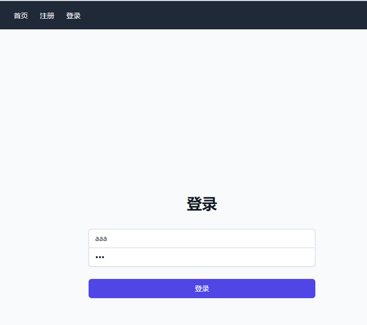

用fitten code AI插件对话的方式写的前后端分离的例子。

frontend：使用vue3、tailwindcss

backend：使用flask。代码在my-flask-app目录下。

实现用户注册和登陆功能。

启动backend：

```
python -m venv venv
source venv/bin/activate
pip install flask flask-cors
# 创建数据库
python create_db.py
# 启动app
python app.py
```

启动前端：

```
npm install
npm run serve
```

前端需要根据情况修改.env里的

运行效果：

